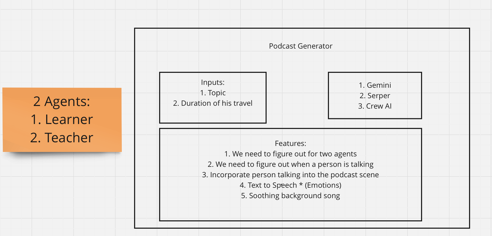
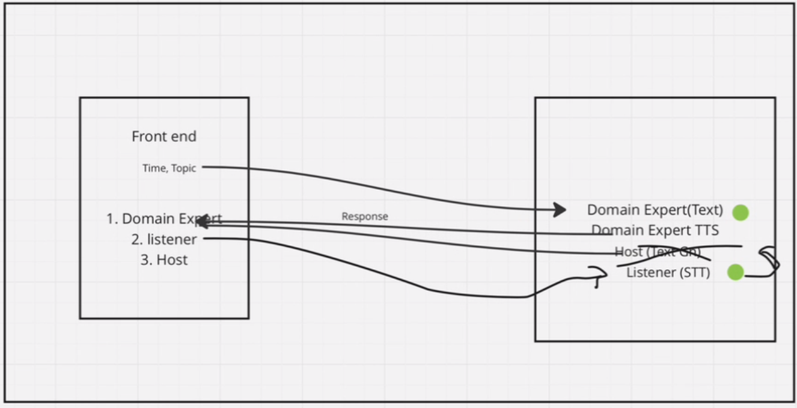

# Learn hands free

## Problem We Face Everyday

Many people spend a significant amount of time commuting or traveling, during which they often wish to utilize this time productively. Traditional methods of learning, such as watching YouTube videos, require visual attention and aren't safe for driving or hands-free activities. This presents a challenge for those who want to learn new concepts or explore interesting topics during their travel time without compromising safety.

### Now we present to you the following:

Imagine a commuter driving to work who wants to learn about quantum mechanics. They activate the podcast, and the engaging host introduces the topic. The domain expert AI then explains quantum principles, answers questions from the host, and addresses listener queries received during the podcast session.

## Solution

To address this issue, we propose a podcast generator using AI agents. This innovative solution involves creating dynamic audio content where two AI agents collaborate:

1. **Engaging Host AI**: This AI agent acts as a charismatic podcast host, similar to popular figures like Lex Fridman or Joe Rogan. The host's role is to ask thought-provoking questions, create a conversational atmosphere, and guide the listener through the topic.

2. **Domain Expert AI**: This AI agent serves as the knowledgeable expert on the chosen topic. Its role is to provide detailed explanations, share insights, and clarify complex concepts in a way that is engaging and easy to understand.

### Key Features:

- **Topic Customization**: Users can select topics of interest ranging from technology, science, history, to personal development.
  
- **Interactive Learning**: Listeners can ask questions during the podcast, and the domain expert AI will respond, enhancing engagement and providing a personalized learning experience.

- **Hands-Free Experience**: Designed for commuters, the podcast is entirely audio-based, allowing listeners to absorb knowledge without needing to divert visual attention from driving or other activities.

## Conclusion

The podcast generator using AI agents aims to revolutionize how people use their travel time by transforming it into a valuable learning experience. By leveraging AI technology to create interactive and informative content, we empower individuals to explore new ideas, expand their knowledge, and stay engaged with learning—all while maintaining safety and convenience during their daily routines.

This project not only addresses a practical need but also showcases the potential of AI in enhancing educational opportunities in everyday life.

## Future improvements that can be made

- Incorporate emotions to Text-to-Speech
- Imporve UI
- Improved response time

## Challenges that we faced

- Dealing with audio integration from front end to backend and vice versa
- Working with AI agents (Crew AI), this was hard to make it work as we never worked with AI agents, but eventually figured out
- Tried various text-to-speech libaries that have emotions but found that they were too heavy and almost none were free to use.
- Working together remotely had its own challenges.
- As we are new to the hackathon world, finishing this project in the given time constrains posed its own challenges (divding tasks and staying in sync were the most challenging parts)
- The most difficult was dealing with AI agents response integration from front end to backend and vice versa as we had to even consider listeners questions into consideration.

## Agents Tasks Overview

### Task 1: Host Introduction and Interesting Applications

- **Description**: Introduce the show and discuss interesting applications of the topic.

### Task 2: High-Level Overview of the Topic

- **Description**: Provide a high-level overview of the topic and outline what will be discussed.

### Task 3: Engaging Host Questions and Perspectives

- **Description**: Gradually deepen the conversation with thought-provoking questions and perspectives on the expert's explanations.

### Task 4: Domain Expert's Deep Dive into the Topic

- **Description**: Dive deeper into the topic, explaining complex concepts and responding to the host’s questions.

**Team Members:**
- [Sai Ravi Teja Gangavarapu](https://github.com/FloareDor)
- [Sai Siddhartha Vivek Dhir Rangoju](https://github.com/vivekdhir77)

**Hackathon Name and Date:**
- Calcodefest
- June 2024